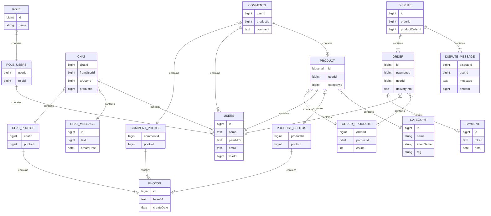

### P2P platform

```mermaid
    erDiagram
    PRODUCT }|--|| CATEGORY:  contains
    PRODUCT }|--|| PRODUCT_PHOTOS:  contains
    PRODUCT ||--|| USERS: contains
    PRODUCT }|--|| ORDER_PRODUCTS: contains
    
    PRODUCT_PHOTOS ||--|{ PHOTOS:  contains
    COMMENT_PHOTOS ||--|{ PHOTOS:  contains

    COMMENTS ||--|{ PRODUCT: contains
    COMMENTS ||--|{ USERS: contains
    COMMENTS }O--|| COMMENT_PHOTOS: contains

    CHAT ||--|{ USERS: contains
    CHAT }|--|| CHAT_MESSAGE: contains
    CHAT }|--|| CHAT_PHOTOS: contains
    CHAT_PHOTOS ||--|{ PHOTOS:  contains

    ORDER }|--|| ORDER_PRODUCTS: contains
    ORDER }|--|| USERS: contains
    ORDER ||--O| PAYMENT: contains
    
    ROLE }|--|| ROLE_USERS: contains
    ROLE_USERS ||--|{ USERS: contains
    
    DISPUTE ||--|{ DISPUTE_MESSAGE: contains
    DISPUTE ||--|{ ORDER: contains
    
    CATEGORY{
        bigint id
        string name
        string shortName
        string tag
    }
    
    PRODUCT{
        bigserial id
        bigint userId
        bigint categoryId
    }
    
    PRODUCT_PHOTOS{
        bigint productId
        bigint photoId
    }
    COMMENT_PHOTOS{
        bigint commentId
        bigint photoId
    }
    
    PHOTOS{
        bigint id
        text base64
        date createDate
    }
    
    ROLE{
        bigint id
        string name
    }
    
    ROLE_USERS{
        bigint userId
        bigint roleId
    }
    
    USERS{
        bigint id
        text name
        text passMd5
        text email
        bigint roleId
    }
    
    COMMENTS{
        bigint userId
        bigint productId
        text comment
    }
    
    CHAT{
        bigint chatId
        bigint fromUserId
        bigint toUserId
        bigint productId
    }
    CHAT_MESSAGE{
        bigint id
        bigint text
        date createDate
    }
    CHAT_PHOTOS{
        bigint chatId
        bigint photoId
    }
    
    DISPUTE{
        bigint id
        bigint orderId
        bigint productOrderId
    }
    
    DISPUTE_MESSAGE{
        bigint disputeId
        bigint userId
        text message
        bigint photoId
    }
    
    ORDER{
        bigint id
        bigint paymentId
        bigint userId
        text deliveryInfo
    }
    
    PAYMENT{
        bigint id
        text token
        date date
 
    }
    
    ORDER_PRODUCTS{
        bigint orderId
        bifint porductId
        int count
    }
```

