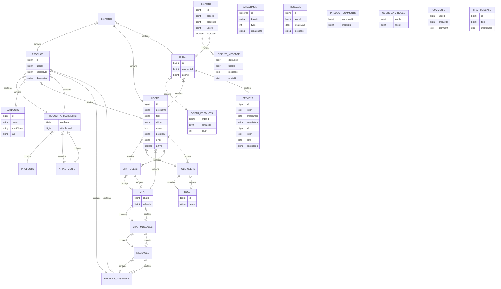

### P2P platform

```mermaid
    erDiagram
    
    PRODUCT }|--|| PRODUCT_ATTACHMENTS: contains
    
    PRODUCT }|--|| CATEGORY:  contains
    PRODUCT }|--|| USERS: contains
    PRODUCT }|--|| PRODUCT_ATTACHMENTS: contains
    PRODUCT }|--|| PRODUCT_MESSAGES: contains
    
    PRODUCT_ATTACHMENTS }|--|| PRODUCTS: contains
    PRODUCT_ATTACHMENTS }|--|| ATTACHMENTS: contains
    
    PRODUCT_MESSAGES }|--|| PRODUCT: contains
    PRODUCT_MESSAGES }|--|| MESSAGES: contains
    
    MESSAGES }|--|| PRODUCT_MESSAGES: contains
    MESSAGES }|--|| CHAT_MESSAGES: contains
   
    DISPUTES }|--|| PRODUCT: contains
    DISPUTES }|--|| USERS: contains
    DISPUTES }|--|| ORDER: contains
    
    ATTACHMENTS }|--|| PRODUCT_ATTACHMENTS: contains
    
    CHAT }|--|| CHAT_USERS: contains
    CHAT }|--|| CHAT_MESSAGES: contains
    CHAT ||--|{ USERS: contains
   
    CHAT_USERS }|--|| CHAT: contains
    CHAT_USERS }|--|| USERS: contains
    
    CHAT_MESSAGES }|--|| CHAT: contains
    CHAT_MESSAGES }|--|| MESSAGES: contains
    
   
  
    USERS }|--|| CHAT_USERS: contains
    USERS }|--|| ROLE_USERS: contains
    
    ROLE_USERS }|--|| USERS: contains
    ROLE_USERS }|--|| ROLE: contains
    
    ROLE }|--|| ROLE_USERS: contains
    
    ORDER }|--|| ORDER_PRODUCTS: contains
    ORDER }|--|| USERS: contains
    ORDER ||--O| PAYMENT: contains
    
  
    
    DISPUTE ||--|{ DISPUTE_MESSAGE: contains
    DISPUTE ||--|{ ORDER: contains
    
    ATTACHMENT{
        bigserial id
        string base64
        int type
        string createDate
    }
    
    CATEGORY{
        bigint id
        string name
        string shortName
        string tag
    }
    
    CHAT{
        bigint chatId
        bigint adminId
    }
    
    DISPUTE{
        bigint id
        bigint orderId
        bigint productId
        bigint userId
        boolean isClosed
    }
    
    MESSAGE{
        bigint id
        bigint userId
        date createDate
        string message
    }
    
    ORDER{
        bigint id
        bigint paymentId
        bigint userId
    }
    
    PAYMENT{
        bigint id
        text token
        date createDate
        string description
    }
    
    PRODUCT{
        bigint id
        bigint userId
        bigint categoryId
        string description
    }
    
    ROLE{
        bigint id
        string name
    }
    
    USERS{
        bigint id
        string username
        string first name
        string last name
        string passMd5
        string email
        boolean active
    } 
    
    
    
    
    
    
    
    
    
    
    
    
    
    
    
    
    
    
    
    
    
    
    
    
    
    PRODUCT_ATTACHMENTS{
        bigint productId
        bigint attachmentId
    }
    PRODUCT_COMMENTS{
        bigint commentId
        bigint productId
    }
    
   
    
    USERS_AND_ROLES{
        bigint userId
        bigint roleId
    }
    
    
    COMMENTS{
        bigint userId
        bigint productId
        text comment
    }
   
    CHAT_MESSAGE{
        bigint id
        bigint text
        date createDate
    }
    
    
    DISPUTE_MESSAGE{
        bigint disputeId
        bigint userId
        text message
        bigint photoId
    }
    
    
    
    PAYMENT{
        bigint id
        text token
        date date
        string description
    }
    
    ORDER_PRODUCTS{
        bigint orderId
        bifint porductId
        int count
    }
```

